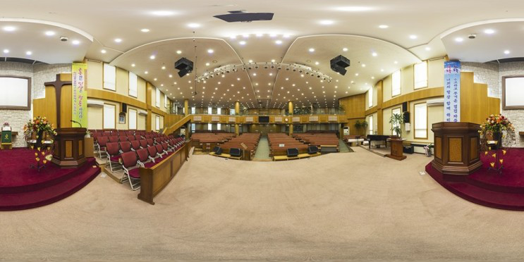

# ECL_Lesson
> This is a first Lesson in ECLab   
## __Goal__   
구면 파노라마 영상을 큐브맵 영상으로 변환하는 수학적인 변환식을 모두 이해하고, 변환 코드식을 작성한다.   
___  

- __메인 함수에서는 아래 3단계를 실행.__  

    1. __구면 파노라마 영상을 읽어 들이기__

    2. __변환함수 호출하기__     

    3. __변환된 6개의 큐브맵 이미지를 저장하기__   
        - 변환함수는 다음과 같이 구성함:   
            - 함수명 : _CvtSph2Cub_    
                1. 큐브맵 영상에서의 좌표가 큐브맵에서 Top, Bottom, Front, Back, Right, Left 중 어떤 면에 위치했는지 찾아야 한다. 이에 따른 큐브맵 좌표를 얻는다.   
                2. (x, y, z)로 표현되는 큐브맵 좌표를 (r, Θ, ∮)로 표현되는 구면 좌표계로 변환한다.   
                3. 구면 좌표계를 구면 파노라마 영상의 좌표계로 변환하고 __입력된 구면 파노라마 영상에서 해당하는 좌표의 정보를__ 큐브맵 영상에서의 좌표에 저장한다.   
                4. 큐브맵으로 부터 Face를 얻는다.   
            - 입력 인자 : 구면 파노라마 영상 포인터   
            - 출력 인자 : 큐브맵 영상들의 배열( 배열 크기 6 )   
            - 기타 : 변환 시 필요한 파라미터 변수값은 상수 심볼로 정의해서 사용.   

- __위 함수의 반대 방향 변환 함수 구현__   
    - 함수명: CvtCub2Sph   
    - 입력 인자: 6개의 큐브맵 영상 배열   
    - 출력 인자: 하나의 구면 파노라마 영상   

- __현재(2022-07-16 코드 결과)__   

       

   

